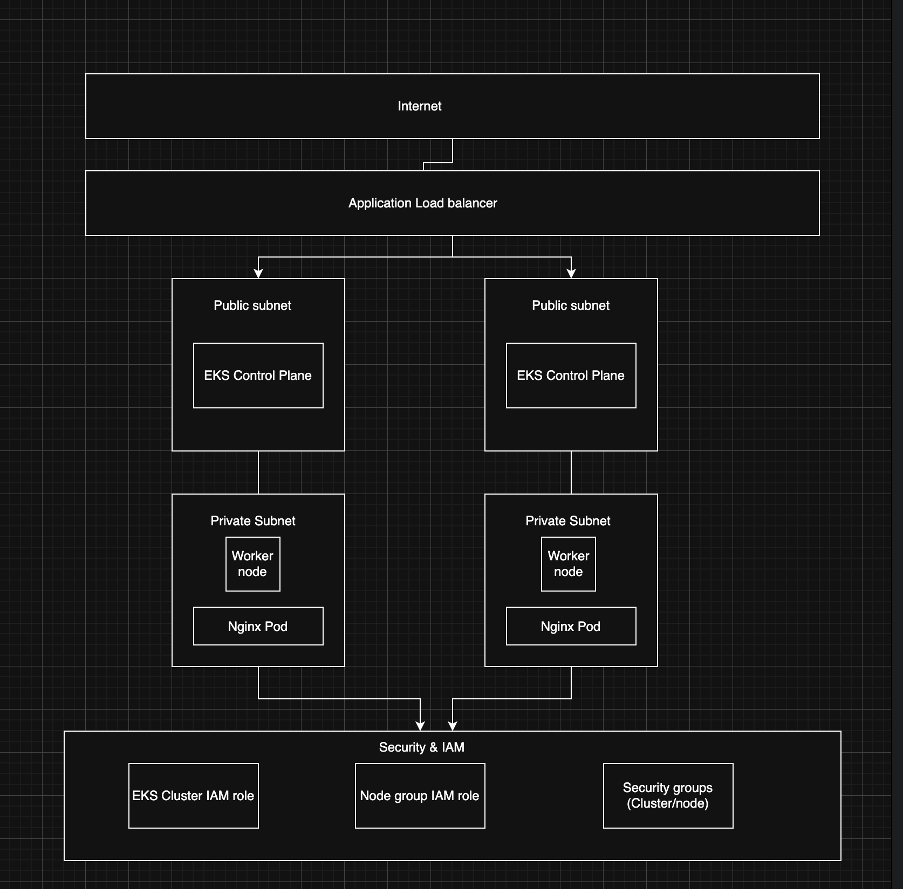
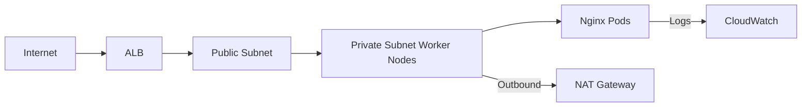

# AWS EKS Cluster with ALB and Nginx Deployment

## Overview
Terraform-managed EKS cluster with secure networking, IAM roles, and Helm-deployed Nginx.



##  Architecture Components

### Core Infrastructure
| Component               | Purpose                                                                 |
|-------------------------|-------------------------------------------------------------------------|
| **VPC**                 | Isolated network with public/private subnets across 2 AZs               |
| **Internet Gateway**    | Public internet access for ALB                                         |
| **NAT Gateway**         | Secure outbound internet for worker nodes                              |
| **EKS Control Plane**   | Managed Kubernetes API server                                          |

### Application Layer
| Component               | Description                                                             |
|-------------------------|-------------------------------------------------------------------------|
| **Worker Node Group**   | EC2 instances in private subnets (t3.medium)                           |
| **Application ALB**     | Distributes traffic across worker nodes                                |
| **Nginx Deployment**    | Helm-managed pods with 2 replicas                                      |

## Data Flow


## Security Implementation

- **Least Privilege**: Nodes only get necessary permissions  
- **IRSA**: IAM Roles for Service Accounts for pods  
- **EKS-Cluster-Role**: Cluster management  
- **EKS-Node-Role**: Worker node operations  
- **ALB**: Only ports 80/443 open  
- **Worker Nodes**: Only allow traffic from ALB security group (ports 30000–32768)  
- **Control Plane**: Private endpoint with restricted CIDR

## Steps to reproduce the setup
## Prerequisites
- AWS CLI configured with access and secret keys
- Terraform installed
- kubectl installed
- Helm installed
- jq and base64 CLI tools


1. Clone the repository:
```bash
git clone https://github.com/seemadurrani/devops-challenge.git
cd devops-challenge
```

2. Provision the EKS cluster with Terraform:
```bash
cd terraform
export AWS_ACCESS_KEY_ID=<your-access-key>
export AWS_SECRET_ACCESS_KEY=<your-secret-key>
terraform init
terraform apply
```

Configure kubeconfig:
```bash
aws eks --region <your-region> update-kubeconfig --name <cluster-name>
```

3. Deploy the sample application using Helm:
```bash
cd ../helm
helm install nginx-app .
kubectl get svc
```
> **Note:** Note the `EXTERNAL-IP` from the LoadBalancer service.

4. Install Argo CD:
```bash
cd ../argocd
chmod +x install-argocd-on-k8s.sh
./install-argocd-on-k8s.sh
```

5. Get the Argo CD admin password:
```bash
kubectl -n argocd get secret argocd-initial-admin-secret -o jsonpath="{.data.password}" | base64 -d
```

6. Access Argo CD UI:
```bash
kubectl port-forward svc/argocd-server -n argocd 8080:443
```
> **Note:** Open https://localhost:8080 \
> **Note:** Login with username: admin and password from previous step

7. Deploy via Argo CD:
```bash
kubectl apply -f argocd/argocd-manifest.yaml
```

## Result
- EKS cluster provisioned by Terraform
- Helm-deployed application
- GitOps workflow with Argo CD


