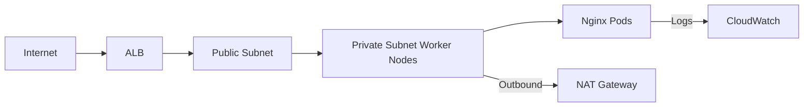

# AWS EKS Cluster with ALB and Nginx Deployment

## Overview
Terraform-managed EKS cluster with secure networking, IAM roles, and Helm-deployed Nginx.

##  Architecture Components

### Core Infrastructure
| Component               | Purpose                                                                 |
|-------------------------|-------------------------------------------------------------------------|
| **VPC**                 | Isolated network with public/private subnets across 2 AZs               |
| **Internet Gateway**    | Public internet access for ALB                                         |
| **NAT Gateway**         | Secure outbound internet for worker nodes                              |
| **EKS Control Plane**   | Managed Kubernetes API server                                          |

### Application Layer
| Component               | Description                                                             |
|-------------------------|-------------------------------------------------------------------------|
| **Worker Node Group**   | EC2 instances in private subnets (t3.medium)                           |
| **Application ALB**     | Distributes traffic across worker nodes                                |
| **Nginx Deployment**    | Helm-managed pods with 2 replicas                                      |

## Data Flow

## Security Implementation

Least Privilege: Nodes only get necessary permissions
IRSA: IAM Roles for Service Accounts for pods
EKS-Cluster-Role: Cluster management
EKS-Node-Role: Worker node operations
ALB	Only ports 80/443 open
Worker Nodes: Only allow traffic from ALB SG (port 30000-32768)
Control Plane: Private endpoint with restricted CIDR

## Steps to reproduce the setup

## Prerequisites

- AWS CLI configured with access and secret keys
- Terraform installed
- kubectl installed
- Helm installed
- jq and base64 CLI tools

## Repository Structure

- terraform/: Terraform code to provision EKS
- helm/: Helm chart for a simple web application
- argocd/: Argo CD install script and manifests

## Steps to Reproduce the Setup

1. Clone the repository:

git clone https://github.com/seemadurrani/devops-challenge.git
cd devops-challenge

2. Provision the EKS cluster with Terraform:

cd terraform
export AWS_ACCESS_KEY_ID=<your-access-key>
export AWS_SECRET_ACCESS_KEY=<your-secret-key>
terraform init
terraform apply

Once the cluster is created, configure your local kubeconfig:

aws eks --region <your-region> update-kubeconfig --name <cluster-name>

3. Deploy the sample application using Helm:

cd ../helm
helm install nginx-app .
kubectl get svc

Note the EXTERNAL-IP from the LoadBalancer type service.

4. Install Argo CD:

cd ../argocd
chmod +x install-argocd-on-k8s.sh
./install-argocd-on-k8s.sh

5. Get the initial Argo CD admin password:

kubectl -n argocd get secret argocd-initial-admin-secret -o jsonpath="{.data.password}" | base64 -d

6. Port-forward Argo CD UI:

kubectl port-forward svc/argocd-server -n argocd 8080:443

Then open https://localhost:8080 in your browser.  
Login with:  
Username: admin  
Password: (from the command above)

7. Deploy the application via Argo CD:

kubectl apply -f argocd/argocd-manifest.yaml

Argo CD will sync and deploy the application using the manifest.

## Done!

You now have:
- An EKS cluster provisioned by Terraform
- A Helm-deployed application
- GitOps workflow enabled via Argo CD

